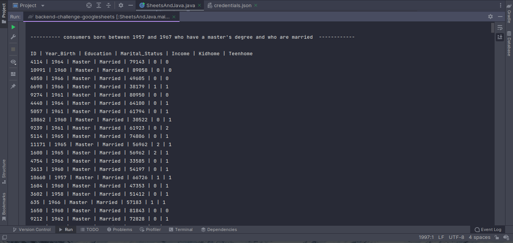
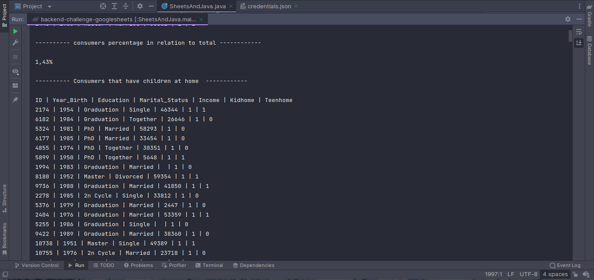
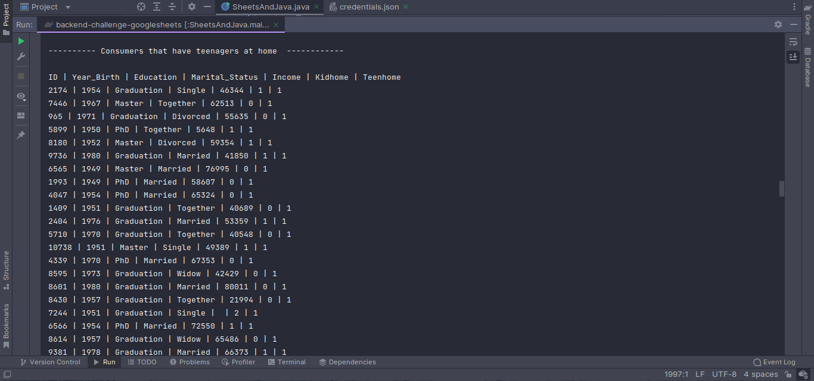

# What was accomplished in the challenge
<ul>
<li>Find consumers born between 1957 and 1967 who have a master's degree and who are married</li>
<li>What percentage of consumers found in relation to the total</li>
<li>How many have children at home</li>
<li>How many have teenagers at home</li>
</ul>

# Images

